> 🔄 **【长期持续更新承诺】**
> 本教程由团队**长期维护并持续更新**！我们会实时跟进 Google Antigravity 官方最新版本机制、风控规则、扫码验证打法与防封策解。只要官方有任何新变动或新报错，均会第一时间在此更新，请放心收藏关注！

---

## 🚑 先看这里：遇到问题先看图对号入座

目前大家遇到的绝大多数问题，都是下面这三种报错。**请先对照截图；网页里点图可放大查看，点下方蓝色链接会跳到对应解决办法。**

| 🛑 **账号地区/资格不符** | ⚠️ **网络超时/未接管** | 🛂 **人机扫码验证** |
| :---: | :---: | :---: |
| [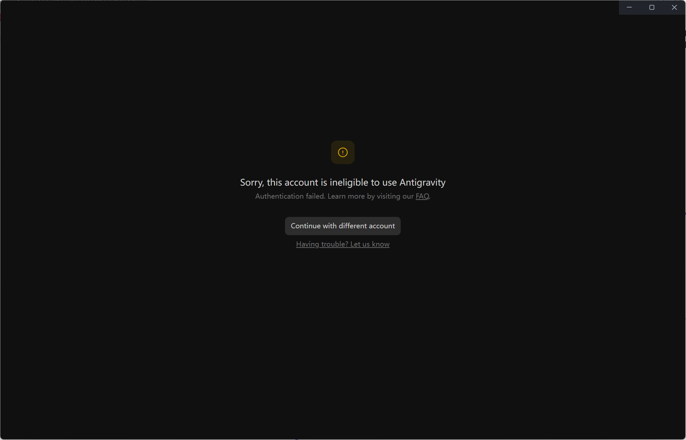](#faq-auth-ineligible) | [](#network-config) | [](#human-verify) |
| **Sorry, this account is ineligible** | **There was an unexpected issue setting up your account.** | **Further action is required** |
| [👉 点此处理地区/资格/年龄](#faq-auth-ineligible) | [👉 点此按第三章配置网络](#network-config) | [👉 点此查看扫码验证流程](#human-verify) |

> 💡 **怎么对号：**
> * **账号没资格**：优先查地区与资格，再查年龄认证（==不要先反复注入==）。
> * **unexpected issue / 网络超时**：就是客户端没真正走通代理——请按 **第三章网络配置** 处理（Tun / ProxyBridge 等）。
> * **Further action / 扫码验证**：登录阶段的人机验证，见扫码流程；**年龄认证**在「账号没资格」那一条处理。
> * **对话时报 `400` 且提示 `User location is not supported for the API use.`**：==出口地区不被支持==，先换日/新等干净节点并重开客户端 → [点此直达排障 Q3](#faq-chat-400)。
> * 只想要原来 VS Code 界面：下载 **Antigravity IDE**，==不要只点官网最上面的 Antigravity 2.0==。
> * 发消息一直转圈、模型刷不出来：优先当网络未接管，==不要先反复注入账号==。

---


## 一、 环境配置与准备工作

在正式使用 Antigravity IDE 或 Antigravity 2.0 前，请务必完成以下自检，这是保证软件正常运行的基石：

1. **基础网络通畅**：请确保您的设备已开启有效的代理工具，且能够顺畅访问 Google 等海外服务。（注：本指南不包含基础代理节点的搭建教学）。
2. **账号状态健康**：准备一个状态正常的 Gemini Pro/Ultra 账号。
   * *注：免费账号可作为测试使用，但存在较高的不可用率。如果您的账号已出现 `403 Forbidden` 报错或已被 Google 封禁，将无法登入。*

> 🚨 **【风控与防封号 · 必看】**
> 如果您的 Gemini Pro/Ultra 订阅是通过非官方常规渠道（大幅低于官方 $20/月 售价）获取的，请注意随时可能面临被取消订阅的风险。
> 此外，在日常使用中，==切忌频繁切换跨国节点 IP==。频繁的地理位置跳跃极易触发 Google 的安全风控机制，导致账号掉权。==请固定使用长期稳定的优质节点==。

---

## 二、必看：先分清 Antigravity IDE 与 Antigravity 2.0

Google 更新后，Antigravity 已经不再只有一个客户端。请先确认您正在使用的是哪一个版本，否则后面的路径和界面对不上，会直接影响排障判断。

1. **Antigravity IDE**：这才是原教程里那个接近 VS Code 的版本，有侧边栏、扩展面板、SSH、语言服务等结构。旧版 Antigravity 更新后，如果仍保留 VS Code 风格界面，通常就按 Antigravity IDE 处理。
2. **Antigravity 2.0**：这是新的独立桌面应用，界面和旧版 IDE 已经不是一回事，主打项目与 Agent 编排，不再是 VS Code 那套界面。它的安装目录和后台进程路径也发生了变化。
3. **Antigravity CLI / SDK**：它们属于命令行和开发者工具链，不在本篇图形客户端教程范围内。

> **关键结论：** 本教程仍然覆盖 Antigravity IDE 和 Antigravity 2.0 的网络、登录与验证问题，但涉及“程序路径”“ProxyBridge 规则”“扩展/SSH”的步骤时，必须按自己实际使用的版本选择对应路径。

> **给老用户的重要提醒：** 如果您原来安装的是旧版 Antigravity，它更新后可能会变成 Antigravity 2.0；这是官方的新产品方向，不是安装包损坏。大多数想继续使用原来 VS Code 风格界面的用户，请安装或保留 **Antigravity IDE**。官方更新流程中可能会提示是否重新安装 IDE，建议需要旧界面的用户选择保留/安装 IDE。

> 如果您想要原来 VS Code 那种编辑器界面，请下载 **Antigravity IDE**，不要只点官网页面最上面的 **Antigravity 2.0**。2.0 是新的独立桌面应用，不再是传统 IDE。

官方下载入口：[https://antigravity.google/download](https://antigravity.google/download)。进入页面后不要只点最上面的 Antigravity 2.0，请向下找到 **Antigravity IDE** 区域，再选择 Windows 对应版本下载：

* 普通 Intel / AMD 电脑：选择 **Windows - Download for x64**。
* ARM 设备：选择 **Windows - Download for ARM64**。

如果您只是想跟着本教程原来的截图操作，或者需要扩展面板、SSH、ProxyBridge 旧路径，请优先安装 **Antigravity IDE**，不要误装成只面向新界面的 Antigravity 2.0。

常见 Windows 安装路径参考：

| 版本 | 常见安装根目录 | 语言服务进程路径 |
| --- | --- | --- |
| Antigravity IDE | `E:\Antigravity` 或您自定义的安装目录 | `resources\app\extensions\antigravity\bin\language_server_windows_x64.exe` |
| Antigravity 2.0 | `C:\Users\你的用户名\AppData\Local\Programs\antigravity` | `resources\bin\language_server.exe` |

**👀 最简单的辨别方法：看电脑「桌面」上的图标显示**
这里说的黑/白，是指 **桌面快捷方式图标** 的观感（Windows 桌面 / 开始菜单磁贴上看到的那个图标底色），**不是**软件内部自己切换的深色/浅色主题。
* ⬜ **桌面图标整体偏白、浅色底**：一般是 **Antigravity 2.0**。
* ⬛ **桌面图标整体偏黑、深色底**：一般是 **Antigravity IDE**。

打开软件后还可再确认：IDE 接近 VS Code（侧边栏、扩展面板）；2.0 更像新的项目 / Agent 工作台。

---

## 三、必做：核心网络配置（三选一） {#network-config}

**📌 为什么必须要单独配置网络？**
Antigravity IDE 和 Antigravity 2.0 的底层网络请求都可能不会完整遵循 Windows 的系统代理规则（常规代理软件无法稳定接管它们的流量）。如果不进行额外配置，软件会出现"无网络"、模型无法加载、消息一直转圈等问题。

请根据您的实际情况，在以下三种方案中选择一种。==强烈建议直接使用「首选方案：Tun 模式」==，仅在遇到冲突时再尝试进阶方案。

### 🌟 首选方案：Tun 模式虚拟网卡（最稳定、最快捷）

**原理简介**：Tun 模式会在您的电脑上创建一张"虚拟网卡"，强制接管所有软件的底层网络流量，完美解决 Antigravity 不走代理的问题。

1. **开启 Tun 模式**（以主流的 **Clash Verge / Clash Verge Rev** 为例）：
   * 打开代理软件，找到并开启"**虚拟网卡模式（Tun 模式）**"。
   * **关闭**常规的"系统代理"。
   * 路由规则请选择"**规则 (Rule)**"。
   * *补充说明：如果您使用的是其他客户端（如 Clash Meta 系、部分带“增强模式/服务模式”的工具），请开启与 Tun 等价的全局接管能力。*
2. **安装网卡依赖**：如果开启失败，通常是因为缺少虚拟网卡驱动。点击 Tun 模式旁边的"扳手/齿轮"图标，按照提示一键安装依赖。
   * *排错技巧：如果下载依赖卡住，请先用其他方式翻墙后再试。如果有多个代理软件在后台运行，请务必全部退出，只保留一个，避免网卡冲突。*
3. **连通性验证**：配置完成后，打开浏览器访问 Google 首页。如果能秒开，说明底层网络已接管成功，可以进入下一步登录。

---

### 🔧 进阶备选一：ProxyBridge 桥接（底层系统代理）

**适用场景**：适用于 Antigravity IDE 和 Antigravity 2.0，可按应用和后台进程设置代理规则。需注意该方案可能会被"火绒"等安全杀毒软件误拦截。

1. **前置网络设置**：需**关闭** Tun 模式，**开启**"系统代理"及"**规则**"模式。
2. **下载桥接软件**：前往 [ProxyBridge Releases](https://github.com/InterceptSuite/ProxyBridge/releases)，在 Assets 处下载 `.exe` 结尾的安装包并完成安装。

   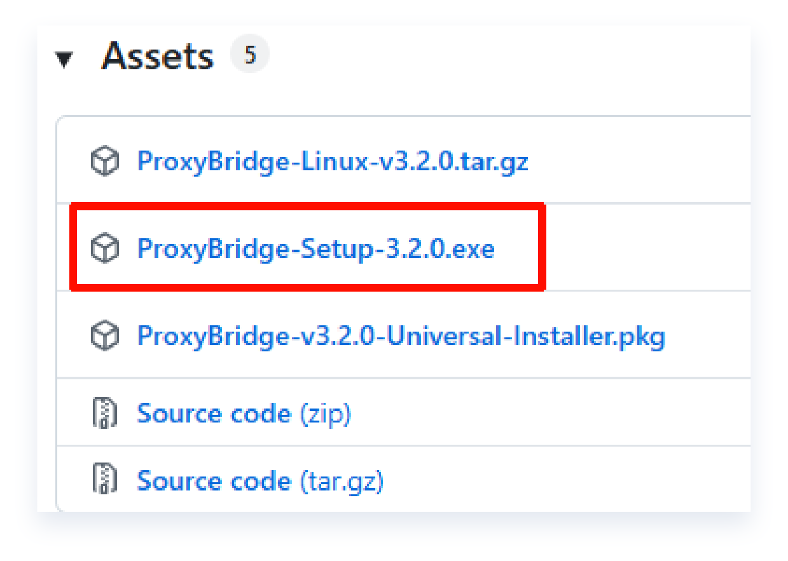

3. **软件汉化**：打开 ProxyBridge，点击上方菜单栏的 **Settings**，将 Language 修改为中文。

   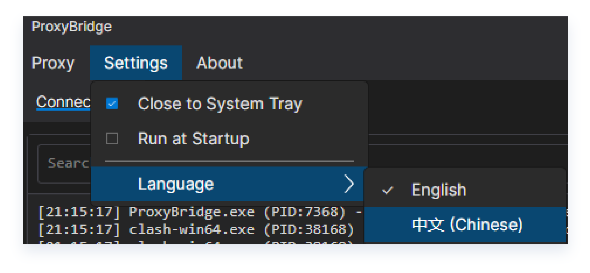

4. **配置代理信息**：
   * 点击左上角"代理" -> "代理设置"。

   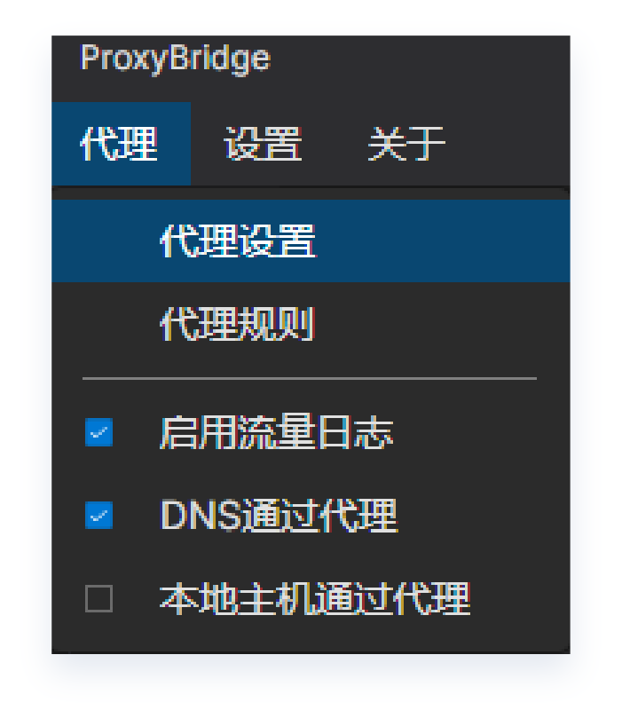

   * IP 地址固定填写：`127.0.0.1`。
   * 端口号：填写您代理软件的实际端口。常见端口为 Clash `7890`、Clash Verge `7897`、v2rayN `10808`。
   * **端口号获取方法**：若不清楚端口，可右键点击 Windows 任务栏空白处 -> `任务栏设置` -> 搜索并进入 `代理服务器设置` -> 找到 `手动设置代理`，点击右侧的 `编辑`。弹窗中显示的端口数字即为您当前软件的代理端口。

   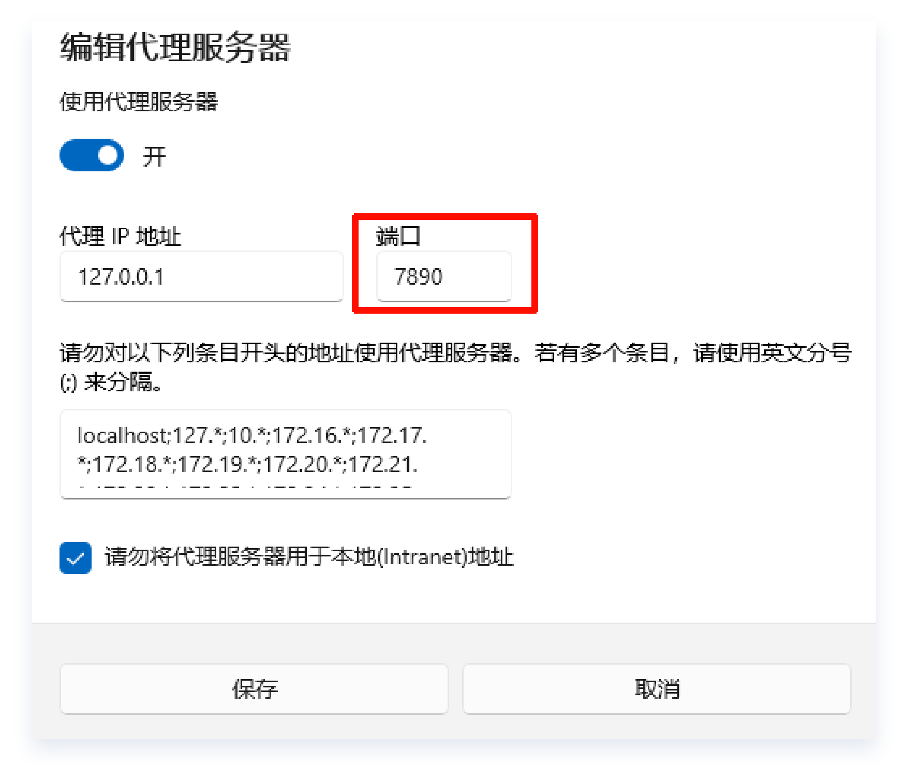

   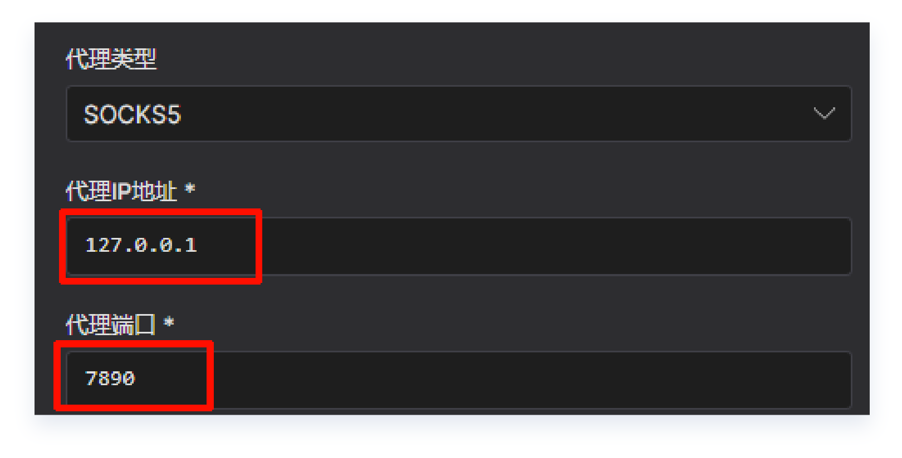

   * *（如果后续连接失败，可在此处的 http 和 socks5 协议之间来回切换排查）。*

```copy-dashboard
本机代理地址 (Host): 127.0.0.1
常见代理端口 (Port): 7897
备用代理端口 (Port): 7890
```

5. 点击下方"测试代理连接"，日志出现 `SUCCESS` 提示后保存。

   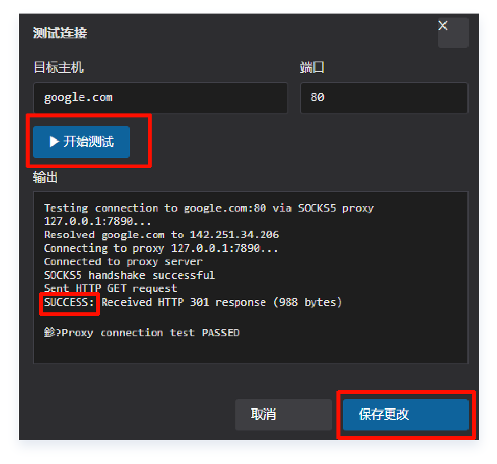

6. **添加路由规则**：
   * 回到主界面，点击"代理" -> "代理规则" -> 点击右上角"添加" -> "浏览"。

   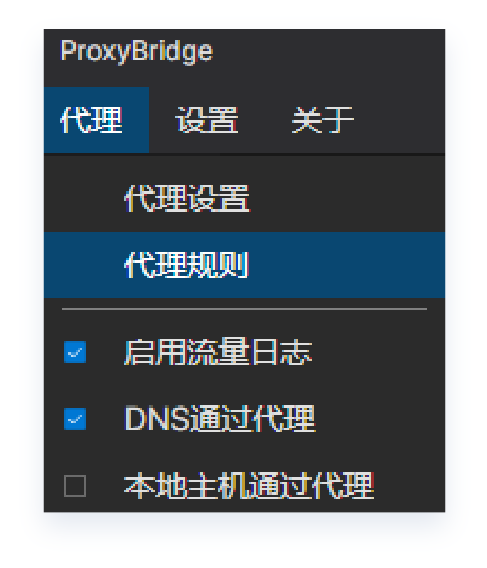

   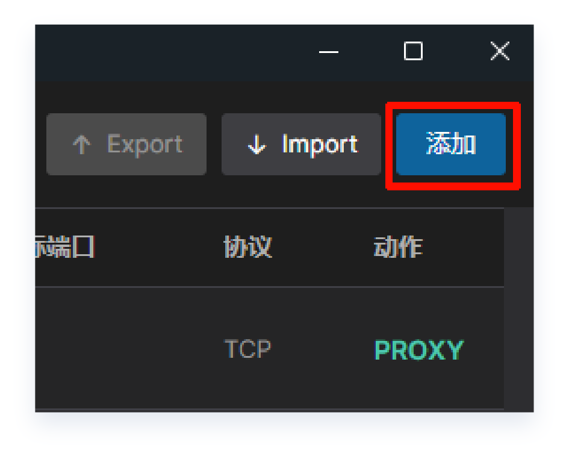

   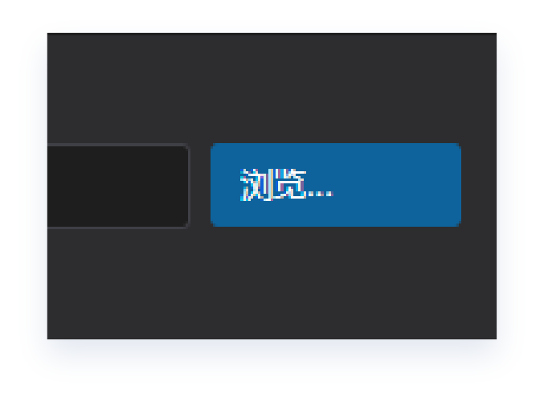

   * 第一次添加：选择当前客户端根目录下的主程序。Antigravity IDE 通常是 `Antigravity.exe`；Antigravity 2.0 通常位于 `C:\Users\你的用户名\AppData\Local\Programs\antigravity`，进入该目录后选择主程序。

   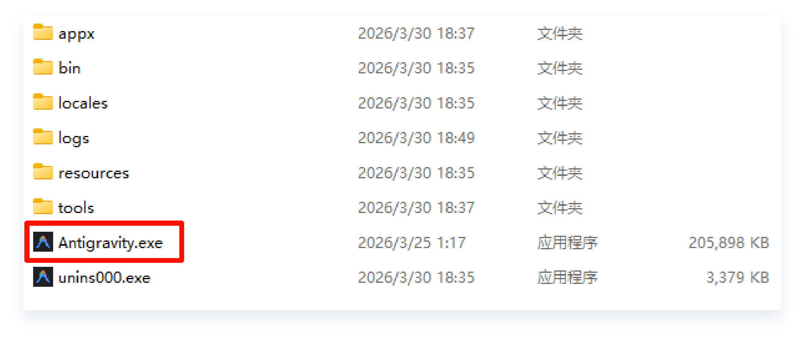

   * 第二次添加：再次点击"添加"和"浏览"，按您使用的版本选择语言服务进程：
     * **Antigravity IDE**：选择 `Antigravity\resources\app\extensions\antigravity\bin\language_server_windows_x64.exe`。例如安装在 `E:\Antigravity` 时，完整路径通常是 `E:\Antigravity\resources\app\extensions\antigravity\bin\language_server_windows_x64.exe`。
     * **Antigravity 2.0**：选择 `antigravity\resources\bin\language_server.exe`。默认安装时，完整路径通常是 `C:\Users\你的用户名\AppData\Local\Programs\antigravity\resources\bin\language_server.exe`。

   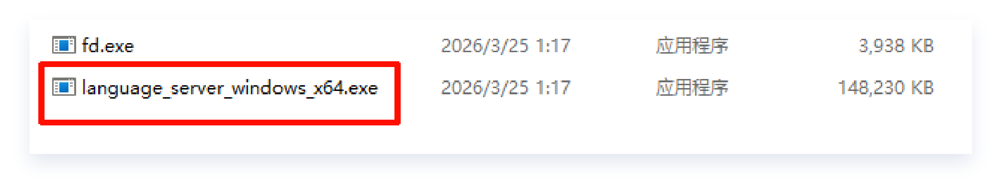

   * 如果 ProxyBridge 支持添加多个规则，建议把主程序和对应的 `language_server` 都加入；如果仍然无法联网，再打开任务管理器观察 Antigravity 正在运行的子进程，把可疑的 `antigravity` / `language_server` 相关 `.exe` 一并加入规则。
   * **不要误选 `webm_encoder.exe`**：新版 Antigravity 2.0 的 `resources\bin` 里可能会出现 `webm_encoder.exe`，它更像是官方用于录制/视频编码的辅助组件，不是 ProxyBridge 的主要代理目标。ProxyBridge 仍然优先添加主程序和对应的 `language_server.exe`。
   * 滑动到页面底部点击**保存**，配置即刻生效。

   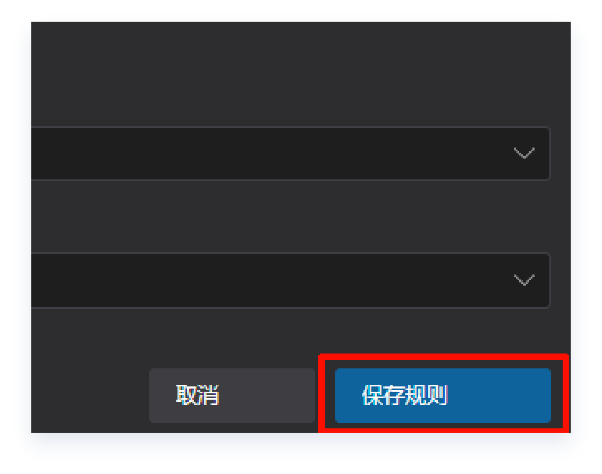

---

### 🔧 进阶备选二：Antigravity-Proxy 插件（局部代理）

**适用场景**：主要适用于 Antigravity IDE 或旧版 VS Code 风格 Antigravity。由于电脑环境复杂（如存在安全软件拦截、企业内网限制）导致 Tun 模式无法使用时，可采用此插件方案。

> 💡 **提示：** Antigravity 2.0 的内部结构已经变化，不建议优先使用 `version.dll` 这类旧版补丁方案。2.0 用户请优先使用 Tun 模式；Tun 无法使用时，再尝试 ProxyBridge。若您曾安装过此插件，后续出现启动极慢、空白或模型异常，请进入软件根目录删除 `version.dll` 文件，并切回其他方案。

1. **前置网络设置**：打开您的代理软件，**关闭** Tun 模式，**开启**"系统代理"，路由同样选择"**规则**"。
2. **下载核心插件**：访问开源仓库 [Antigravity-Proxy Releases](https://github.com/yuaotian/antigravity-proxy/releases)。
3. 在页面的 **Assets** 区域，下载最新的压缩包（如 `antigravity-proxy-v1.8-win-x64.zip`）。

   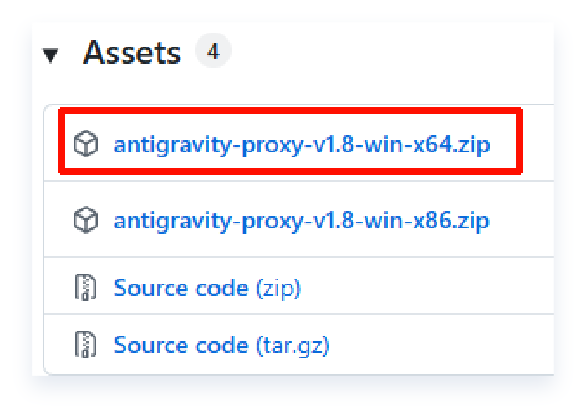

4. **放置补丁文件**：解压后，将 `config.json` 和 `version.dll` 两个文件移动到 Antigravity 的安装根目录。
   * *定位根目录捷径：在开始菜单或桌面上找到 Antigravity IDE 快捷方式 -> 右键选择"打开文件所在位置"。如果您打开后看到的是 Antigravity 2.0 的新目录，请不要强行套用本插件方案。*

   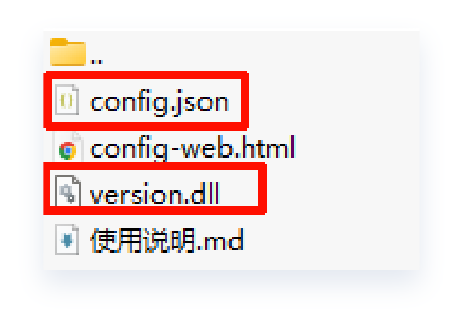

   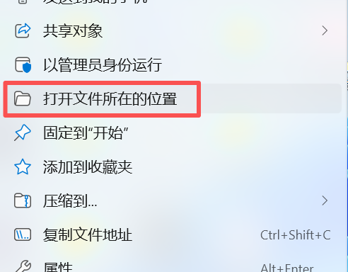

   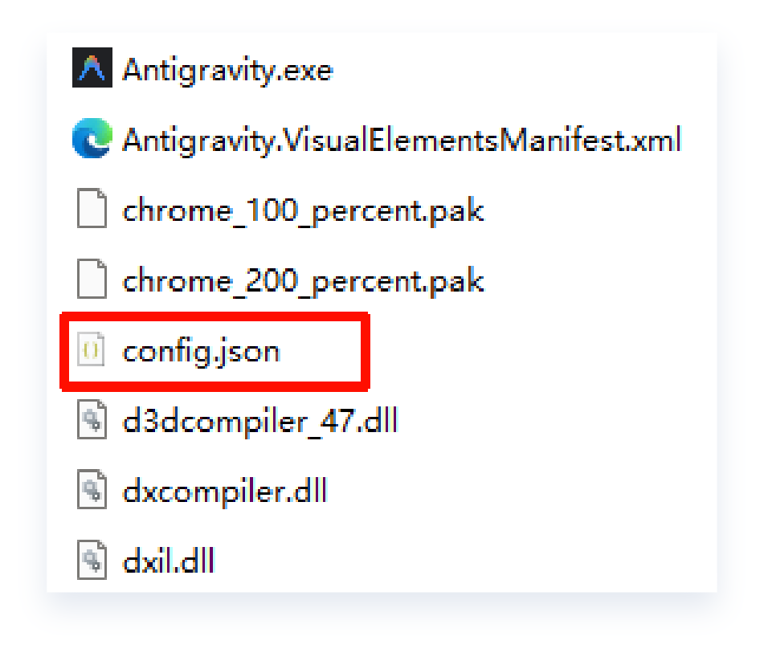

5. **修改代理端口**：用记事本打开刚放进去的 `config.json` 文件，定位到最下方的端口号（默认可能是 `7890`）。

   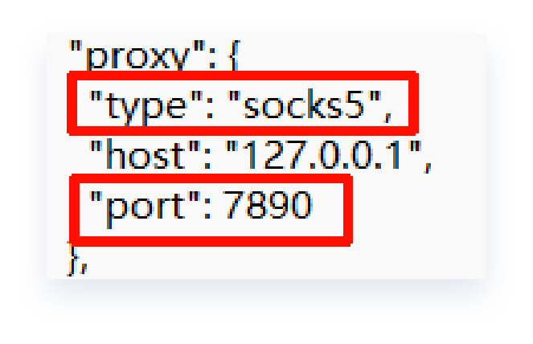

   * **获取端口号方法**：如不清楚端口号，可按上文提示进入 Windows `代理服务器设置` 查看，或直接参考下方的极速复制默认端口。
   * 将获取到的端口号填入 `config.json` 并保存。**注意：不要改动系统自身的代理设置，只改 json 文件。**
   * *（如遇协议不兼容，可尝试将 `type` 后的 `socks5` 更改为 `http` 或 `https`）。*

   常见代理软件默认端口极速复制：
```copy-dashboard
Clash默认端口 (Port): 7890
Clash Verge默认端口 (Port): 7897
v2rayN默认端口 (Port): 10808
```

---

## 四、 账号登录与授权流程

网络打通后，即可启动 Antigravity IDE 或 Antigravity 2.0 进行授权。两个版本的入口界面不同，但底层逻辑一致：先尝试标准浏览器授权，失败后再考虑 Cockpit Tools 本地授权辅助。

### 4.1 标准网页登录

1. 直接运行当前使用的客户端：Antigravity IDE 或 Antigravity 2.0。
2. 按照界面提示，软件会拉起您的默认浏览器。使用已开通服务的 Google 账号完成 OAuth 授权。
3. 若跳转后提示成功，说明授权完毕，可直接进入下一部分的验证与对话测试。

*如果在此步骤页面无响应、反复报错，请先分清是网络未接管、账号地区资格不通过，还是本地授权状态异常。不要反复点登录，以免触发更严格的风控。*

> 如果点击登录后长时间没有任何反应，通常不是账号问题，而是 Antigravity 客户端请求超时，说明网络还没有真正接管到软件流量。请先停止反复点击登录，回到第三章检查 Tun 是否开启、ProxyBridge 规则是否包含主程序与 `language_server`，以及代理端口是否填对（常见如 `7890`、`7897`）。

### 4.2 Cockpit Tools 本地授权辅助（状态注入方案）

> 🛡️ **【Cockpit Tools 现在的定位】**
> 目前官方风控严格，Cockpit Tools ==不再是用来绕过「账号没资格」的强登工具==。如果官方判定地区、年龄或资格不符，强行注入 Token 也无法绕过服务端校验。
> 它现在的主要价值是：**多账号切换 / 管理更方便**，以及处理浏览器跳转无响应、客户端状态错乱、本地授权写入失败等问题。请把它当作**本地授权辅助**，==不要指望它绕过官方资格校验==。

> 🔄 **新版工具说明：** 请从 GitHub Releases 下载**最新版**再操作（旧文截图可能仍标注 v0.24.0 一类版本号，以页面最新包为准）。新版已对齐官方 **Antigravity IDE** 路径与 `antigravityUnifiedStateSync.oauthToken` 等状态读写。想沿用 VS Code 风格界面的用户，请优先使用 **Antigravity IDE**，不要和 2.0 混路径操作。

1. **下载工具**：前往 [Cockpit Tools Releases](https://github.com/jlcodes99/cockpit-tools/releases)，点击 **Show all assets**，下载最新的 Windows x64 安装包（文件名通常类似 `Cockpit.Tools_*_x64-setup.exe`）。

   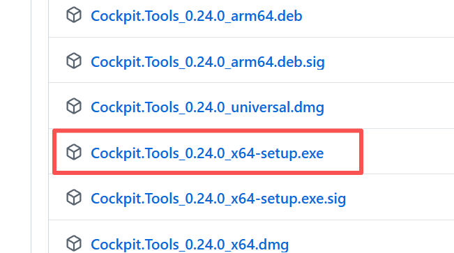

2. **安装说明**：因开源软件缺乏微软签名，浏览器或 Windows Defender 可能会提示"未知风险"。请在弹窗中点击"**更多信息**" -> "**仍要运行**"，一路 Next 完成安装。
3. **基础设置**：打开 Cockpit Tools，点击左下角的齿轮/设置图标，将语言切换为**中文**。

   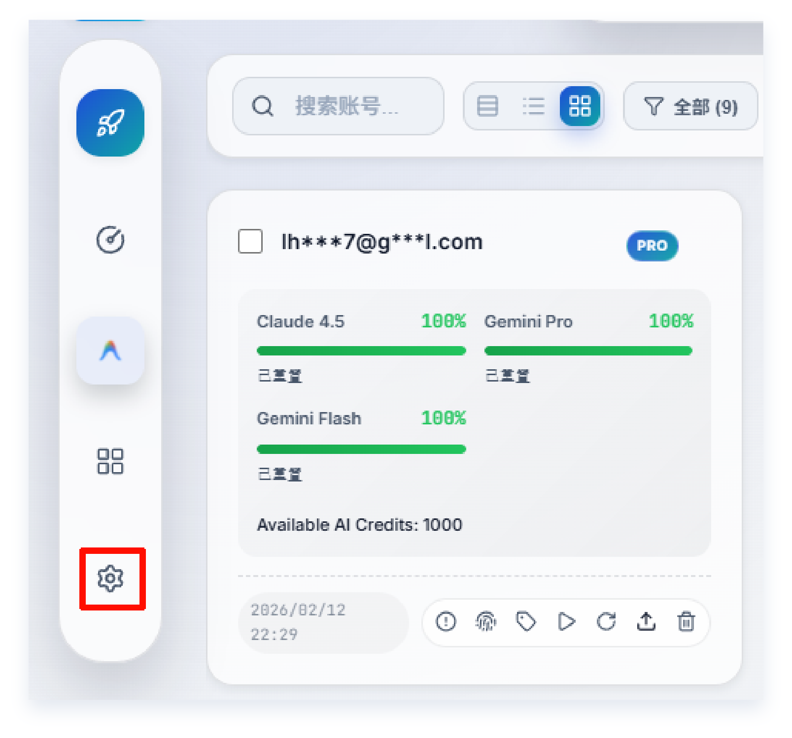

4. **绑定账号**：在左侧导航栏找到 `Antigravity IDE` 或 `Antigravity` 图标并点击，点击页面中央的"**添加账号**"按钮（或蓝色加号）。新版 Cockpit Tools 的 Antigravity 集成主要面向官方 **Antigravity IDE**；如果您的目标是新式 Antigravity 2.0，请不要套用旧版 IDE 的截图和路径判断。

   

   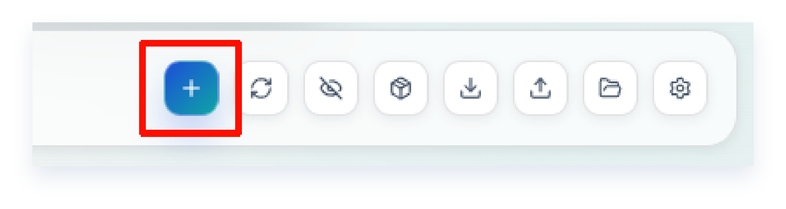

5. 点击"**开始 OAuth 授权**"，在弹出的浏览器沙盒中登录您的 Google 账号。

   

6. **本地状态写入**：登录成功后返回软件，会显示已绑定的账号卡片。点击账号卡片下方的"**▶ 播放**"按钮，把本地授权状态写入 Antigravity IDE。

   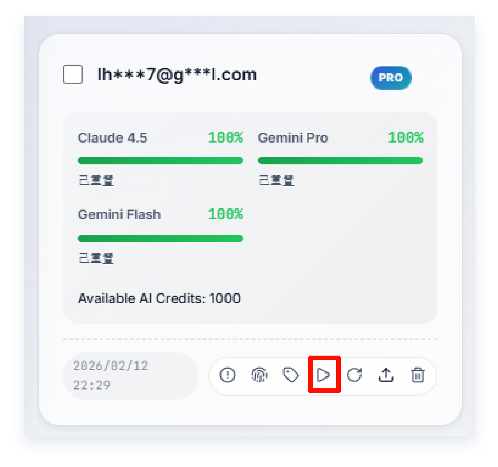

7. 在弹出的路径确认窗口中，点击路径框右侧的"**刷新/选择**"图标，确认路径无误后点击"**保存**"。新版 Cockpit Tools 已适配官方重命名后的 Windows 主程序 `Antigravity IDE.exe`。如果自动识别失败，请手动选择 **Antigravity IDE** 的安装目录，例如 `E:\Antigravity`，并确认主程序是 `Antigravity IDE.exe`。此时 Antigravity IDE 会被自动唤醒或重启。

   * *关键排错：如果您电脑上同时安装了 Antigravity IDE 和 Antigravity 2.0，而路径却指向 `C:\Users\你的用户名\AppData\Local\Programs\antigravity`，这通常是 2.0 路径。若您的目标是旧版 VS Code 风格界面，请手动切回 Antigravity IDE 的路径。*

   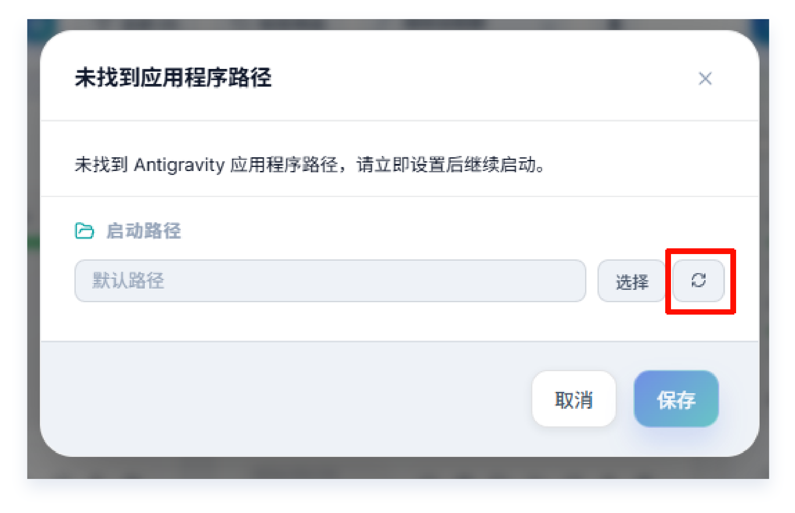

   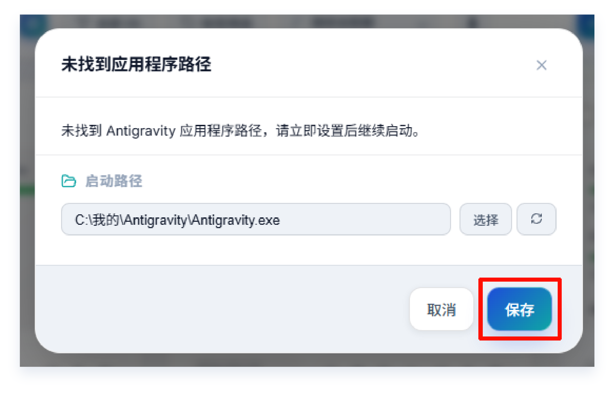

8. 观察客户端界面：Antigravity IDE 通常会在编辑器右侧或顶部加载出**模型选择下拉框**；Antigravity 2.0 则可能表现为项目/对话界面可以正常创建 Agent、加载模型或发送消息。只要账号状态能被识别并进入可对话状态，即代表本地授权状态写入成功。若仍提示没资格或认证错误，请按 FAQ 里的三类报错继续判断，不要反复强行注入。

   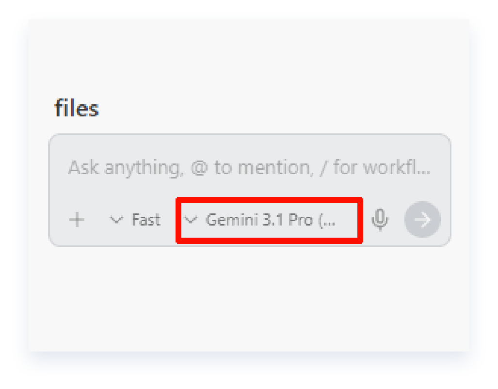

---

## 五、 防机器人人机验证（必做） {#human-verify}

为对抗机器批量滥用，系统会进行二次核验。**现在不会等您登录进去再发消息才验证：多数情况下，登录授权阶段就会直接弹出验证要求。**

1. 登录时如果看到类似下图提示 `Further action is required to use Antigravity`，请点击 `Verify` 或 `Sign in again` 继续。

   

2. **验证双通道选择：推荐使用下方两种最可靠的方案**

---

### 💡 通道一（推荐）：谷歌云 Cloud Shell 短信验证通道（支持国内 +86 手机号）

> 🌟 **核心原理**：Antigravity 与谷歌云 (Google Cloud) 共享底层的身份验证系统。只要您的 Google 账号在谷歌云顺利完成手机号验证，Antigravity 即可**同步全自动过关**！该方法完整支持绑定中国大陆 (+86) 手机号接收验证码。

1. **访问谷歌云验证授权入口**：
   建议在浏览器打开**无痕模式**，访问：[https://docs.cloud.google.com/docs/authentication?hl=zh-cn&cloudshell=true#service_accounts](https://docs.cloud.google.com/docs/authentication?hl=zh-cn&cloudshell=true#service_accounts)。登录您的目标 Google 账号。

2. **激活 Cloud Shell 触发验证**：
   登录后刷新页面，滑动到页面中下方，找到并点击 **“激活 Cloud Shell” (Activate Cloud Shell)** 蓝色按钮。

   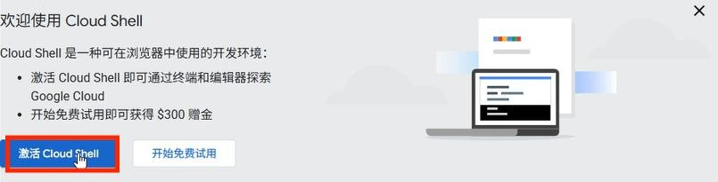

3. **选择填写手机号验证**：
   勾选同意授权点击下一步，系统会弹出验证界面。在验证选项中点击 **“Verify your phone number” (填写手机号验证)**。

   

4. **输入国内手机号接收验证码**：
   点击国旗列表选择 **China (中国 +86)**，在输入框填入自己的国内手机号，点击 Next 接收并填入 6 位短信验证码完成验证。

   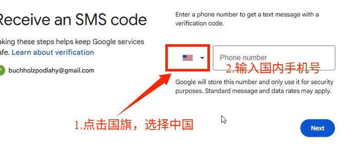

   

5. **回到 Antigravity 完成登录**：
   * 短信验证成功后，回到 Antigravity 界面点击 `Verify` 按钮，浏览器会自动唤起并显示 **“身份验证成功”**！
   
     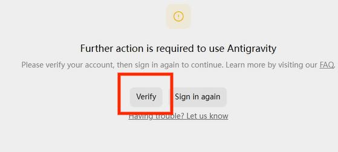

     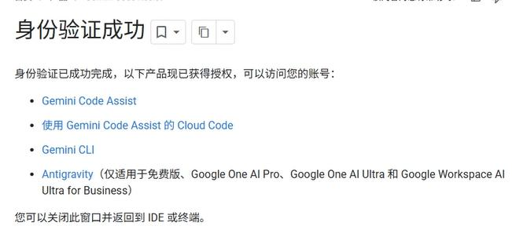

   * 接着回到 Antigravity 客户端，点击 `Sign in again` 按钮重新登录，即可顺利成功进入 Antigravity！

     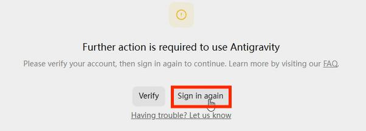

---

### 📱 通道二：手机 Google App 内置扫码（“焚决”打法）

1. **扫码前先对齐环境**：
   * 手机与电脑尽量使用**同一干净节点、同一出口 IP**。
   * 准备 Android / iOS 手机，安装并登录 **Google App**（安卓手机需在设置中开启“谷歌基础服务”），登录相同的 Google 账号。

2. **使用内置 Google Lens 扫码**：
   * 打开 Google App，点击搜索框右侧的**相机/镜头图标 (Google Lens)** 扫描电脑屏幕上的验证二维码（==不要用微信或普通相机扫==）。

   

3. **手机端确认**：
   * 手机弹窗选择 **“是，继续”**。必须看到手机端屏幕最终显示 **“您现在已通过验证”** 才算真正成功！

   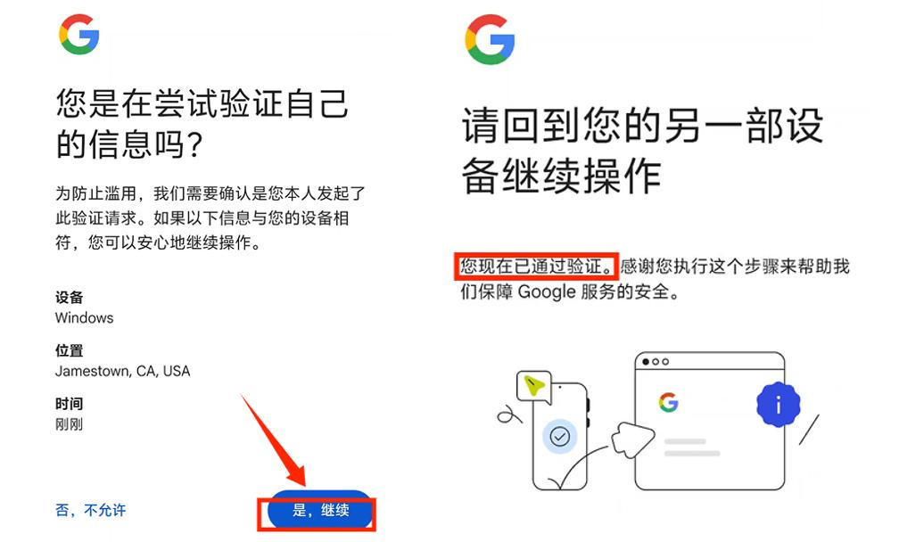

4. **死磕与重试机制**：
   * 如果手机显示验证手机号或电脑显示失败，**切记不要放弃，连续多试几次（反重力点 Sign in again 重新扫码，反复试 7 次以上）**。若仍然不行，可尝试通道一。

---

### 🛡️ 补充工具：Antigravity Tools 开源账号管理（免第三方反代）

为保障账号安全，避免使用危险的第三方反代导致封号，推荐使用开源的 [Antigravity Tools (Antigravity-Manager)](https://github.com/lbjlaq/Antigravity-Manager/releases)。下载后只需通过官方 OAuth 授权，即可实现多账号本地安全一键管理与切换。


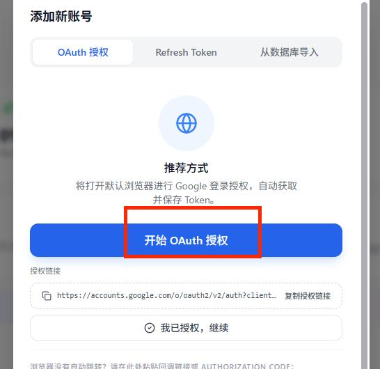
---

## 六、 附加功能：SSH 远程连接配置

> ⚠️ **排雷提示**：本节主要面向 Antigravity IDE。Antigravity 2.0 已经是新的独立 Agent 桌面应用，不再是传统 VS Code 风格 IDE；如果您使用的是 2.0，请优先使用其项目/权限/终端相关新功能，不要强行套用旧版扩展面板截图。如果不是刚需，建议直接忽略此步骤。

如必须使用，遇到连接异常时请按以下步骤适配：

1. 下载专用扩展包：[Antigravity SSH Proxy](https://open-vsx.org/extension/dinobot22/antigravity-ssh-proxy)（点击页面右下角紫色 Download 下载）。
2. 打开 Antigravity 侧边栏的"扩展"面板，将下载好的文件直接拖拽进去完成安装。
3. 安装后，点击界面底部的绿色 **ATP** 标识，在输入框填入您的代理软件端口号，滑到最下方保存，然后尝试连接服务器。
   * *关键机制：此功能目前**仅兼容系统代理模式**。如果您前面采用的是首选方案（Tun 模式），在连接 SSH 时，必须**同时打开"系统代理"**开关（即 Tun + 系统代理双开）。连接成功后再将系统代理关掉即可。*
4. 处于 SSH 连接状态后，再次进入侧边栏"扩展"面板，找到类似 `在 SSH:XXX 中安装扩展` 的板块，点击对应的安装按钮将扩展同步至远程服务器终端。
5. 彻底关闭并重启当前窗口，即可完成通道连通。

### 扩展市场加载慢 / 搜不到插件怎么办？

> 💡 **适用范围：** 这一段只针对 **Antigravity IDE** 的扩展面板。Antigravity 2.0 不是传统 VS Code 风格 IDE，请不要强行套用。

如果扩展面板默认提示正在使用 **Open VSX**，可能会出现插件搜索不全、下载很慢、甚至加载失败的情况。可以把扩展市场源切换为 VS Code 官方源。

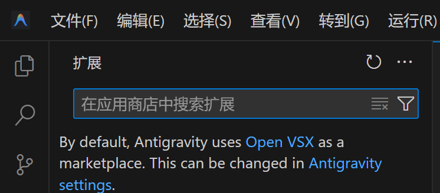

操作方法：

1. 打开左侧 **扩展（Extensions）** 面板。
2. 如果页面提示 `By default, Antigravity uses Open VSX as a marketplace. This can be changed in Antigravity settings.`，点击里面的 **Antigravity settings**。

   

3. 在 `Editor -> Marketplace` 设置里，把下面两个地址分别填入对应输入框。

   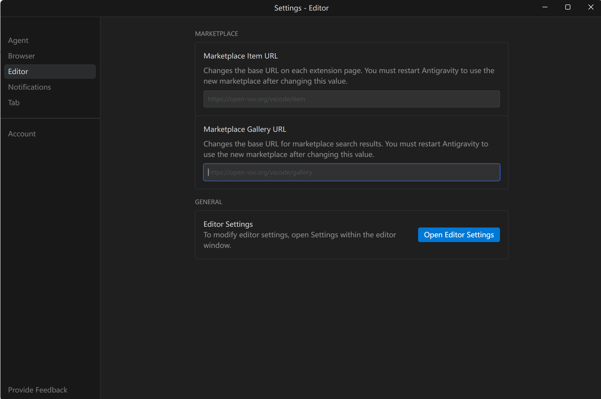

```copy-dashboard
Marketplace Item URL: https://marketplace.visualstudio.com/items
Marketplace Gallery URL: https://marketplace.visualstudio.com/_apis/public/gallery
```

   

填完后，**彻底关闭并重新打开 Antigravity IDE**，再回到扩展面板搜索 `ssh`、`Remote - SSH` 等插件。正常情况下，搜索结果会切到 VS Code 官方插件市场，插件会更全，加载也更稳定。

---

## 七、遇到问题先看这里：常见故障排查 (FAQ)

| 您看到的情况 | 优先判断 | 先看哪一段 |
| --- | --- | --- |
| 打开后不是 VS Code 那种界面 | 装成了 Antigravity 2.0，或旧版更新到了 2.0 | Q0 |
| `Sorry, this account is ineligible to use Antigravity` | 账号地区/资格/年龄/订阅问题 | Q0.5 的账号没资格 |
| `There was an unexpected issue setting up your account.`、登录一直转圈 | 网络没真正走代理 | **第三章网络配置**（亦可看 Q0.5 的 OAuth 说明） |
| `There was an error with your authentication` | 本地授权状态或 Token 状态异常 | Q0.5 的认证错误 |
| 点击登录后接近 1 分钟没反应 | 客户端请求超时，网络没接管 | Q1 / 第三章 |
| 发消息一直转圈、按钮一直灰 | 网络未接管或节点不可用 | Q1 |
| 模型列表/模型名称刷不出来 | 节点异常或多套网络方案冲突 | Q2 |
| ProxyBridge 不知道选哪个文件 | IDE 和 2.0 的 `language_server` 路径不同 | Q2.5 |
| 蓝色 `Retry`，同时有 `400` | 先看报错正文再分流 | Q3 |
| 报错里出现 `code: 400` 且含 `User location is not supported` | 当前出口地区/节点不被 API 支持 | [**Q3 地区 400**](#faq-chat-400) |
| 验证成功后仍反复出现 `Verify / Sign in again` | 年龄验证或客户端登录状态未刷新 | Q4 |
| 大字报错 `There was an unexpected issue setting up your account.` | 节点/登录状态/超时等综合问题 | Q5 |
| 提示“您的身份无法被核实” / 需 Pixel 安全码 | 节点 IP 不够纯净 / 异地登录风控 | Q6 |
| 扩展市场搜不到插件 | 默认 Open VSX 源不稳定 | 第六章扩展市场 |

### Q0：打开后不是 VS Code 界面，为什么和教程截图不一样？

* **原因**：Google 已经把产品拆分为 Antigravity 2.0、Antigravity IDE、CLI、SDK 等不同形态。2.0 是新的独立桌面应用，官方定位是 Agent 编排平台；原教程截图更接近 Antigravity IDE。
* **解决**：网络和登录思路仍可参考本教程，但涉及扩展面板、SSH、VS Code 风格界面、旧版语言服务路径时，请确认自己是否需要改用 Antigravity IDE。若只使用 2.0，请重点参考 Tun 模式、ProxyBridge 新版路径、账号登录与扫码验证部分。

### Q0.5：登录报错先按这三类判断 {#faq-auth-triage}

现在 Antigravity 的登录校验比旧版更严格，不建议一看到失败就反复用 Cockpit Tools 注入。请先按截图判断类型：

<a id="faq-auth-ineligible"></a>

1. **提示账号没资格：优先处理地区/账号资格**

   如果看到 `Sorry, this account is ineligible to use Antigravity`，这通常不是普通 Token 写入问题，而是账号资格、地区、年龄认证或官方准入校验没有通过。

   

   ==处理顺序（请按此先后）：先「地区与资格」，再「年龄认证」。不要先反复注入。==

   **处理建议 1（优先）：检查地区与资格**

   先检查 Google 账号地区、付款资料地区、订阅状态和当前代理节点地区是否一致。此类问题目前不能再简单理解为“Cockpit 强制注入即可解决”；必要时只能调整地区环境或更换符合资格的账号。

   1. **查验反重力官方支持地区**：  
      访问反重力官方 FAQ 页面：[https://antigravity.google/docs/faq](https://antigravity.google/docs/faq)，可查阅反重力当前支持的全部账号国家/地区列表（如 Taiwan、Singapore、Japan、South Korea、United States 等）。

      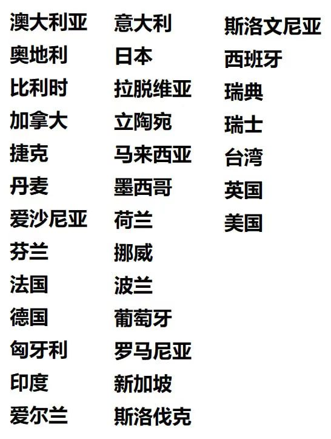

      > 💡 **核心判定法则（非常重要）：**  
      > ==**如果您的账号地区已经在官方支持列表中，但登录时仍显示“账号不符合资格 (ineligible)”，说明问题不在地区，而是需要进行「年龄认证」！请直接看下方的【处理建议 2】。**==

   2. **修改账号关联地区（若当前地区不在支持列表中）**：  
      如果页面提示 `Sorry, this account is ineligible to use Antigravity`，且账号关联的是不支持地区，请按以下步骤申请修改：

      - **第 1 步：查验账号当前关联地区**  
        打开 Google 服务条款页：[https://policies.google.com/terms](https://policies.google.com/terms)，滑动到页面最底部，查看该账号当前关联的国家/地区（如显示中国大陆、中国香港等受限地区则需修改）。

        

      - **第 2 步：打开地区修改申请表单**  
        访问 Google 官方地区更改申请表单：[https://policies.google.com/country-association-form](https://policies.google.com/country-association-form)。

        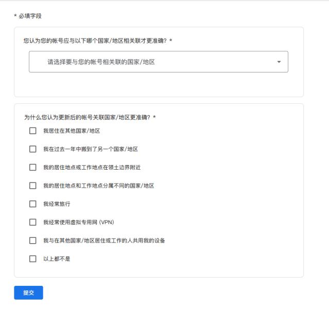

      - **第 3 步：选择目标地区与提交方案**  
        * **方案 A（快捷通过）**：在列表中选择您代理节点最常用的地区（如日本、新加坡、英国、加拿大等），勾选 **“我居住在此”** 并直接提交。
          
          

        * **方案 B（申诉说明）**：若选择最后一个 **“以上都不是”**，可在留言框说明：“*我因工作需要用到 Gemini / Antigravity，请帮我更改账号地区到 xxx*”。

      - **第 4 步：生效确认与年限提醒**  
        🚨 **【极重要提醒】**：==Google 账号地区修改每年仅允许申请一次！一旦修改成功，一年之内不允许再次修改。请务必确认好目标地区再提交！== 提交后等待邮件通知（通常 24 小时内生效），生效后再重新登录 Antigravity。

      如果你确实长期在美国居住或工作，可以参考以下英文申诉模板：

```text
Due to work arrangements, I am currently residing and working in the United States for an extended period. In order to better access local services (including payment methods, app downloads, and region-specific content), I would like to change my account region to the United States.

I have stable internet access and regularly use devices within the U.S., and I also use local payment methods for transactions. Therefore, I kindly request to update my account region to the United States to ensure a smooth user experience.

Thank you for your understanding and support.
```

   **处理建议 2（其次）：人脸自拍年龄认证（解决 Verify -> Sign in again 无限循环）**

   如果网页提示“身份验证成功”，但回到反重力点击 `Sign in again` 后**仍无限循环弹出 Verify 要求**，100% 是因为账号没有通过 18 岁以上年龄认证！

   * **第 1 步**：访问 Google 官方年龄认证专属页：[https://myaccount.google.com/age-verification](https://myaccount.google.com/age-verification)。
   * **第 2 步**：推荐选择 **“Take a selfie / 自拍人脸识别”**（比提供信用卡或上传身份证更简单且成功率最高）。

     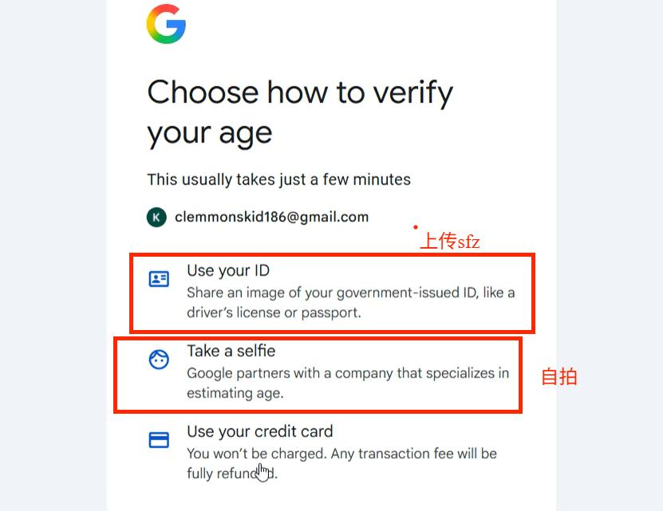

   * **第 3 步**：页面生成二维码或 Link 链接，复制链接或手机扫码在手机浏览器完成刷脸（实测一张脸可无限次刷通过，手机与电脑需挂同一代理节点）。

     

   * **第 4 步**：当手机显示 **“Your age is verified”** 年龄验证成功后，回到 Antigravity 再次点击 `Verify` $
ightarrow$ `Sign in again` 重新登录即可直接解决循环问题！

     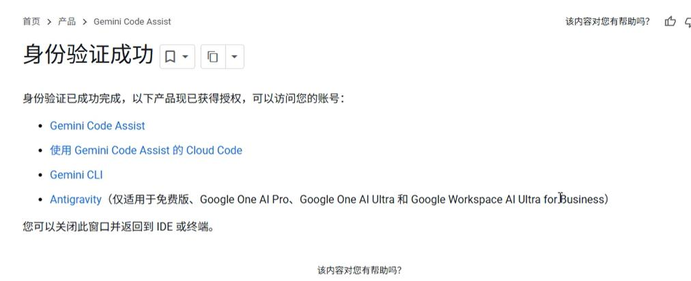

<a id="faq-oauth-network"></a>

2. **提示 `There was an unexpected issue setting up your account.`：优先修网络**

   如果看到大字报错 `There was an unexpected issue setting up your account.`，下方可能还带有 `Post "https://oauth2.googleapis.com/token"`、`connectex`、`failed to respond`、`connection attempt failed` 等详细信息，说明客户端请求 Google OAuth token 接口时没有走通网络。

   

   处理建议：回到第三章检查 Tun 是否真的开启、代理节点是否可用、ProxyBridge 是否把主程序和对应 `language_server` 都加入规则。这个问题的重点是“网络没走上代理”，不是账号没资格。

   如果表现为点击登录后等待接近 1 分钟仍没有任何反应，也按网络问题处理：先不要继续重试，优先回查第三章网络配置、端口号、代理软件开关和分流规则。

3. **提示认证错误：再考虑 Cockpit 本地授权辅助**

   如果客户端里显示 `There was an error with your authentication. To log in, click here`，更像是本地授权状态、Token 写入或客户端认证状态异常。

   

   处理建议：可以使用 Cockpit Tools 重新完成 OAuth 并写入本地状态。但新版官方仍可能继续检测账号资格、地区和 Token 状态，所以 Cockpit 只能作为本地授权辅助，不保证绕过官方服务端校验。

### Q1：登录无反应 / 消息发送后一直转圈

* **现象**：等了很久右下角的发送按钮还是灰色，无法接收回复。
* **诊断**：100% 是网络配置问题，Antigravity 的流量没有走代理。
* **解决**：请按顺序处理：
  1. 先切换一个干净稳定的代理节点，优先选择日本、新加坡等常用地区。
  2. 返回"第三章"，从头检查 Tun 模式是否真实生效，或改用 ProxyBridge 重新接管主程序与 `language_server`。
  3. 如果您当前使用的是 Antigravity 2.0，且反复无回复，可以换成 **Antigravity IDE** 试一次常规登录和对话。

正常情况下，发送消息后几秒钟内，发送按钮应变为"带有红色方块的停止键"或进入生成状态，代表网络已连通并在请求数据。

### Q2：模型刷不出来 / 对话框能加载但无法选择模型

* **诊断**：多为多种网络方案混用导致的底层冲突。
* **解决**：
  1. 先切换代理节点，确认不是当前节点质量差或被服务端拒绝。
  2. 如果节点没问题，再换一种网络方案，例如从 Tun 切到 ProxyBridge，或从旧 `version.dll` 插件方案切回 Tun。
  3. 换方案前必须清除历史配置残留：比如您之前尝试过进阶备选二，现在想换 Tun 模式，必须先进入根目录**删掉** `version.dll`。Antigravity 2.0 用户尤其不建议保留旧版补丁文件。
  4. 重启电脑：释放被占用的虚拟网卡或代理端口，然后认准一种方案重新配置。

### Q2.5：ProxyBridge 应该添加哪个 `language_server`？

* **Antigravity IDE**：添加 `resources\app\extensions\antigravity\bin\language_server_windows_x64.exe`。
* **Antigravity 2.0**：添加 `resources\bin\language_server.exe`。
* **判断方法**：右键桌面或开始菜单快捷方式，选择"打开文件所在位置"，从当前实际安装目录往下找。不要把 IDE 的路径填给 2.0，也不要把 2.0 的路径填给 IDE。
* **不要误选**：如果您在 Antigravity 2.0 的 `resources\bin` 里看到 `webm_encoder.exe`，一般不要把它当作 ProxyBridge 代理目标。它不是语言服务进程，优先选 `language_server.exe`。

### Q2.6：Cockpit Tools 更新后，路径应该怎么选？

* **先下载最新版**：请从 [Cockpit Tools Releases](https://github.com/jlcodes99/cockpit-tools/releases) 下载最新安装包（以页面显示版本为准）。
* **新版改善**：新版会识别 Windows `Antigravity IDE.exe`，并读写官方 `antigravityUnifiedStateSync.oauthToken` 状态，**多账号切换/导入**比旧版更贴近官方客户端。
* **排错重点**：需要 VS Code 风格界面时，请确认路径指向 **Antigravity IDE**。如果路径是 `C:\Users\您的用户名\AppData\Local\Programs\antigravity`，这通常是 Antigravity 2.0，不要按旧 IDE 截图硬套。
* **提醒**：部分版本附带 Codex 相关能力，与 Antigravity 登录不是一回事；Antigravity 仍以 Google OAuth + 本地授权辅助为准。

### Q3：蓝色 `Retry` / 对话报错 / HTTP 400 {#faq-chat-400}

对话时如果右下角或详情里出现报错，**先看两样东西就够定位大半：**

1. **`code` 是多少**（常见是 `400`）
2. **`message` / 英文说明写了什么**（不要只看 Trajectory ID、TraceID、Headers 这些一长串）

<a id="faq-user-location-400"></a>

#### 先认这种高频 400（地区不被支持）

如果详情里类似下面这样（字段可能略有出入，认关键词即可）：

* `HTTP 400 Bad Request` 或 `"code": 400`
* `"message": "User location is not supported for the API use."`
* `"status": "FAILED_PRECONDITION"`

**含义：** 官方按您当前请求出口判断「所在地区不支持该 API」。多数是 **代理节点出口地区不对 / 节点被识别为不支持地区 / 出口不干净**，不一定是账号密码错了。

**处理顺序（按这个做）：**
1. **立刻换节点**：优先日本、新加坡、台湾、香港等常用且稳定的节点；避免大陆直连、避免来历不明的脏节点。
2. 换节点后 **彻底退出 Antigravity（含后台进程）再打开**，重新发一条测试消息。
3. 保持 **长期固定同一地区节点**，不要对话中途频繁跨国跳 IP（既容易 400，也容易触发账号风控）。
4. 若换多个干净节点仍是同一句 `User location is not supported`：再回头查 **Google 账号地区/订阅资格**（见 Q0.5「账号没资格」），以及是否账号本身处于异常状态。
5. ==不要用 Cockpit 反复硬注入来「绕地区」==——Cockpit 解决不了服务端对 location 的校验。

> 💡 一眼口诀：==看见 `400` + `User location is not supported` → 先换支持地区的干净节点，再重开客户端。==

#### 其他导致 Retry / 发消息失败的常见原因

若不是上面的 location 文案，再按下面排查：

1. **Google 账号年龄限制（常见于新号）**
   * Cockpit 里账号角标若出现红色 `unknown`，优先做年龄验证：https://myaccount.google.com/age-verification
   * 建议人脸验证（电脑摄像头或手机扫码；手机需开代理）。证件照片可作备选；**不建议**用银行卡硬验。

   

2. **多开/历史登录残留**  
   以前用过杂七杂八脚本时，请统一改回 Cockpit Tools 规范切号/重登。

3. **Gmail 附属服务冲突（少见）**  
   非 Gmail 主号后来又开通附属 Gmail，偶发身份错乱：可在 Google 账号「数据和隐私」里检查并移除不再使用的 Gmail 服务。

4. **普通 400 / 节点不稳（没有 location 那句时）**
   * 换日本、新加坡等节点，退出客户端重登再试。
   * 长期不行多半是订阅线路或代理工具质量问题，考虑换订阅/换客户端。

5. **多套网络方案叠在一起**  
   Tun、ProxyBridge、`version.dll` 不要同时开。只留一套，清理残留后再测。

6. **账号已被严控/封禁**  
   以上都试过仍各种 Retry，再考虑换干净账号测试。

### Q4：验证成功后仍反复出现 `Verify / Sign in again`

如果浏览器已经显示身份验证成功，但返回 Antigravity 后仍提示 `Further action is required`，或者点击 `Sign in again` 后再次回到 Verify 页面，请按下面顺序处理：


1. 先确认 Google 账号的年龄验证已经真正完成，而不是只完成了二维码设备确认。
2. 完全退出 Antigravity，包括任务管理器中的后台进程，再重新打开。
3. 点击 `Sign in again` 或 `Continue with Google`，使用刚刚完成验证的同一个 Google 账号重新授权。
4. 如果仍然循环，清理浏览器中错误账号的登录状态，确认默认浏览器登录的是目标账号，并等待几分钟后再试。
5. 仍无法通过时，再使用 Cockpit Tools 重新完成一次 OAuth；Cockpit 只能刷新本地授权状态，不能替代官方年龄和地区资格校验。

### Q5：出现 `There was an unexpected issue setting up your account.` (EOF / invalid_grant / 超时)

只要界面出现大字报错 `There was an unexpected issue setting up your account.`，均属于本条排查范围：

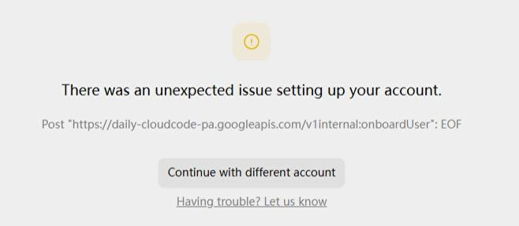

**故障根因与精准排查方案：**
1. **`EOF` (`...onboardUser: EOF` / connectex)**：
   * **根因**：节点质量太差、网络严重不稳定或未被 Tun 模式完全接管。
   * **解决**：开启代理软件的 **Tun 模式 (全局接管)**，切换至质量更高的美区/日区纯净节点，关闭并重新打开 Antigravity，点击 `Continue with different account` 重新登录。
2. **`invalid_grant`**：
   * **根因**：账号的 OAuth 登录 Token 状态失效过期。
   * **解决**：点击 `Continue with different account` 重新走一遍授权流程即可。
3. **`context deadline exceeded`**：
   * **根因**：请求响应超时。检查本地代理设置并换节点重试。

---

### Q6：提示“您的身份无法被核实 / 我们无法验证您的身份”（或需 Pixel 安全码风控）


* **原因**：账号检测到异地登录或频繁变动出口 IP，触发了 Google 底层风控。
* **三招避坑与解决方案**：
  1. **检查与更换纯净 IP**：使用 [ping0.cc](https://ping0.cc) 或 [ippure.com](https://ippure.com) 检测代理节点的 IP 纯净度，优先选择美区住宅/家宽纯净 IP。
  2. **7 天固定设备养号法**：保持固定电脑设备与固定纯净节点，连续使用 Google / Gemini 满 7 天，系统会自动将其升级为受信任的“常用设备”，风控自动解除。
  3. **开通 Google 账户家庭组共享 Pro**：若有自己主号开通的 Pro，可通过家庭组邀请该账号加入共享会员（[邀请教程](https://ikunlove.best/gem)），直接用自己的主账号登录 Antigravity，彻底规避异地风控问题。

> 补充：少数日志里会出现连接中断、授权过期、请求超时等字样，本质仍多半是**网络不稳 / 登录状态失效 / 超时**，按上面四步处理即可，不必先研究底层接口名。

---

## 💬 售后支持与结语

如果您**严格按上述流程操作**，绝大多数情况下登录与使用问题都能解决。按教程把网络、环境、步骤做对，**正常可用是大概率事件**；若仍然用不了，多半是**账号自身异常**或**操作步骤有偏差**，而不是教程“没用”。对电脑不太熟练的用户，也可以直接联系客服下单**远程协助**，由专业人士一对一处理。感谢您的支持！

- **教程持续更新保证**：软件或官方风控规则发生变动时，本教程会**第一时间同步更新最佳解决办法**，确保您始终能查阅到最新、最有效的排障指南。
### 售后群怎么用
- 扫码加入售后群后，**群里消息大家都能看见、都可以回复**，有问题直接在群里发即可。
- **闲鱼私聊请不要发敏感词**（例如违规引流、敏感平台名等），否则对方可能无法回复，问题会卡住。需要细聊技术细节，优先进售后群。

### 扫码验证：有时要看一点「运气」
人机扫码**不是 100% 人人一次过**。有的号环境都对了仍过不去，带一点运气成分，常见两类情况：
1. **账号本身权重/状态偏弱**，天生难过这一关；
2. **之前扫码次数太多**，已经触发 Google 风控。

若属于风控：==建议先停手，等待大约 7 天或更长（常见还有约一个月）再试==，期间狂扫往往没用。  
教程能帮你把网络、环境、步骤做对；**过不过还和账号与风控有关**，请先按教程排查，再判断要不要远程。

### 退款与远程协助（请务必看清）

**温馨提示：**

1. **问题出在账号本身**（环境与步骤已按教程排查完毕，确认为账号资格、风控、权重等自身原因）：教程已提供完整思路，并已协助排查，**此类情况不支持退款**。
2. **您认为账号没有问题**、更希望一对一排查：可以找我做**远程协助**。若远程仍未能解决，**会为您全额退款**。
3. 远程费用约定：已付的**教程款可抵作远程费用**，一般只需**补差价**（以当时约定为准）；远程成功后按远程服务结算。
4. **教程类虚拟内容**原则上售出后不退不换；上述「远程不成全退」是针对**远程服务兜底**，请与「账号自身问题不退」区分清楚。

对操作不熟、时间紧的用户，直接联系客服约远程即可。有问题先扫码进群说明现象；需要远程或核对退款条件，在群里或约定渠道联系。


